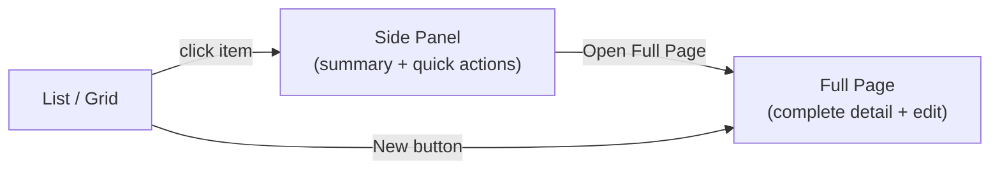

# QonaqDash Frontend Design Decisions

## Documentation split

### Documentation layers

**Design system** — **[design.html](design.html)** and **[main.css](../src/assets/main.css)** together define **top-level visuals**: tokens, shared layout, and reusable components. The gallery loads the same global CSS as the product; anything shown there that is **not** in `main.css` lives in `design.html`’s doc-only `<style>` (or is called out as feature-local until promoted).

**Page specification** — **This file (`design.md`)** describes **concrete screens** (routes, templates, flows) using **design-system naming**: classes and patterns from `main.css` / `design.html`, not ad-hoc one-off names for things that already exist in the system.

**Application (implementation)** — **Vue views** build those pages: compose design-system classes, add page-specific markup, and extend with **`scoped`** CSS only where the screen truly differs. If the same scoped extension appears on **another** screen, **propose** moving it into the design system (neutral classes in `main.css`, and a **design.html** swatch when a visible reference helps). After the proposal is accepted, **refactor** the involved views to use the shared top-level classes and remove duplicate scoped rules.

### Files

| Artifact                                          | Responsibility                                                                                                                                                                                                                                                                                                                                                                                                                                                                                 |
| ------------------------------------------------- | ---------------------------------------------------------------------------------------------------------------------------------------------------------------------------------------------------------------------------------------------------------------------------------------------------------------------------------------------------------------------------------------------------------------------------------------------------------------------------------------------- |
| **[src/assets/main.css](../src/assets/main.css)** | **Shared system CSS**: tokens, typography, colors, and **page/feature-agnostic** layout + components (e.g. `main.app-main` list shell, `search`, `.list-content__viewport`, `.side-panel*`, `.action-toolbar`, dialogs, `.list-table` + row actions (`.list-table__col--actions`, `.list-table__cell--actions`, `.list-table__actions`, `.list-table__action`, `.list-table__icon-btn*`), status chips, form banners). No screen-specific chrome unless it is truly reused by multiple routes. |
| **[design.html](design.html)**                    | **Visual gallery** for the design system: loads `main.css` + **doc-only `<style>`**. Sections run **small → large**: foundation (colors, spacing, type), small components (buttons, chips, loading/states + form-level vs field-level messages), composite (page header outline CTA, toolbars, context menu, search bar, page layout mock), structures (lists, form layout + field/control tokens, side panel, cards, dialogs).                                                                |
| **This file (`design.md`)**                       | **Page-level spec**: audience, shell, **page templates**, **app screens catalog**, **workflow for new pages**, interaction model; references design-system names.                                                                                                                                                                                                                                                                                                                              |
| **Vue views (`*.vue`)**                           | **Implementation**: route-specific composition + `<style scoped>` for genuine one-offs. Prefer design-system classes first; follow the **promotion** rule in [Documentation layers](#documentation-layers) above.                                                                                                                                                                                                                                                                              |
| **[integration.md](integration.md)**              | **API integration (high-level)**: architecture, auth flows, forms, grid semantics, cross-cutting HTTP rules — not a substitute for OpenAPI.                                                                                                                                                                                                                                                                                                                                                    |
| **[swagger.yaml](swagger.yaml)**                  | **OpenAPI contract**: every route, request/response shape, field descriptions, and per-endpoint errors — **canonical** for implementation details.                                                                                                                                                                                                                                                                                                                                             |

---

## CSS placement and naming (convention)

See [Documentation layers](#documentation-layers) for how this fits the overall split.

1. **`main.css`** — Common shared styles only: fonts, sizes, colors (tokens), and **shared** page templates (list shell, side panel, context `.action-toolbar`, search bar rules, etc.). Names must stay **neutral** (no “booking”, “guest”, “dashboard” in class names unless the component is genuinely cross-domain).
2. **`design.html`** — For mocks/swatches: if it isn’t in `main.css`, put the CSS in the file’s **`<style>`** section (duplicate from the Vue view when the production markup lives scoped there).
3. **Vue view files** — Styles **required for that route or external child layout** live in the view’s **`<style scoped>`** (optionally `:deep()` for children). Prefer reusing `main.css` classes first, then extend.
4. **`design.md`** — Describes **what** each screen is, not every CSS line; references template names and shared selectors where useful.

---

## Page templates

Templates are **logical** layouts inside `AppLayout` (`main.app-main`). They compose shared classes from `main.css` unless noted.

| ID     | Template name                           | Extends | Structure & shared selectors                                                                                                                                                                                                                                                                                                                                                                                                                                                                                |
| ------ | --------------------------------------- | ------- | ----------------------------------------------------------------------------------------------------------------------------------------------------------------------------------------------------------------------------------------------------------------------------------------------------------------------------------------------------------------------------------------------------------------------------------------------------------------------------------------------------------- |
| **T0** | **App chrome**                          | —       | Topbar + sidebar + `main.app-main` (flex column, gap). Not a “page”; wraps all authenticated routes.                                                                                                                                                                                                                                                                                                                                                                                                        |
| **T1** | **Default page**                        | T0      | `header.page-header` (h1 + optional `.page-header-actions`). Below: route body. No default section wrapper.                                                                                                                                                                                                                                                                                                                                                                                                 |
| **T2** | **Default list page**                   | T1      | After header: `SearchBar` as direct child of `main` (semantic `<search>`), then `section.list-content` → `div.list-content__viewport` (scroll). **Side panel** (`aside.side-panel*`) as sibling after the viewport (fixed; see `main.css`). Table: `.list-table`, rows `.list-row` / `.list-row--selected`. Optional per-row actions use shared **table row action** classes (see `design.html` Lists); on clickable rows, stop propagation from the actions cell.                                          |
| **T3** | **Default entity detail (full height)** | T1      | `main.app-main` **without** `app-main--fit-content` (see `AppLayout.vue`: detail routes fill height). Header: title + **Edit** / save/cancel in `.page-header-actions` using `.btn-secondary` for secondary actions. Body: FormDSL view/edit or custom blocks; inner scroll (e.g. `.guest-detail-body`) per view scoped CSS. Optional **context** strip: `.action-toolbar` (`BookingStatusActions`) — full-bleed in panel, **inset** (`action-toolbar--inset`) on booking detail when `detailInset` is set. |
| **T4** | **Short form page (fit main)**          | T1      | `AppLayout` adds `main.app-main--fit-content` for specific paths (new entity, profile, manage hotel, form builder tabs). Content often uses `.form-content__viewport` or compact vertical stack.                                                                                                                                                                                                                                                                                                            |
| **T5** | **Home grid / timeline**                | T1      | Root `.dashboard-view` (flex column, scoped in `DashboardView.vue`). **Toolbar row** + **body**: `dashboard-view__toolbar`, `dashboard-view__body`, `dashboard-view__viewport` (scroll). **Content toolbar** (`.content-toolbar`, `.toolbar-picker`, `.toolbar-btn`, …) is **only** in `DashboardView` scoped CSS + duplicated in `design.html`. Grid: `ReservationGrid.vue`. Side panel: booking summary from grid.                                                                                        |
| **T6** | **Auth card**                           | —       | `main.auth-page` (centered card; login / invite). Styles in `main.css` for auth layout.                                                                                                                                                                                                                                                                                                                                                                                                                     |
| **T7** | **Not found**                           | T0      | `.not-found` in `main` + scoped refinements in `NotFoundView.vue`.                                                                                                                                                                                                                                                                                                                                                                                                                                          |

**`app-main--fit-content`** is toggled in `AppLayout` for: `/guests/new`, `/bookings/new`, `/manage/guests/form`, `/manage/bookings/form`, `/manage/hotel`, `/profile`. **Guest and booking detail** (`…/details`) use **full-height** main and inner scroll.

---

## Target Audience

SaaS for all hotel categories -- from a single apartment owner to large international hotel networks. The UI must be **simple enough for a solo operator** yet **scalable for enterprise teams**. Progressive complexity: show only what's relevant, don't overwhelm.

---

## App Shell & Navigation

### Collapsible Sidebar

- **Dark theme**: sidebar uses a dark background (`--sidebar-bg`) with light text; contrasts with the light main content area and emphasizes navigation.
- **Expanded**: icon + label for each section
- **Collapsed**: icons only -- maximizes horizontal space for the reservation grid
- **Remembers** user's collapsed/expanded preference

### Sidebar Items (MVP)

1. **Bookings** -- reservation grid (home/default landing page)
2. **Guests** -- guest list
3. **Management** -- property config, form customization, account

Only 3 items in the sidebar for MVP. Clean and non-intimidating for small operators.

### Header

- Org/hotel name display
- User menu (profile, logout)

---

## App screens catalog

Each row is an **implemented** route. **Extends** refers to [Page templates](#page-templates).

### Auth (no AppLayout)

| Route                 | View             | Template | Routine actions & content                                       |
| --------------------- | ---------------- | -------- | --------------------------------------------------------------- |
| `/auth/login`         | `LoginView.vue`  | **T6**   | Email + password; submit → tokens, redirect home.               |
| `/auth/invite/:token` | `InviteView.vue` | **T6**   | Invite context + set password; `.form-info` / banners per flow. |

### Home grid

| Route | View                | Template | Routine actions & content                                                                                                                                                                                                                                                                                                                                                                                                                                                                                                                                   |
| ----- | ------------------- | -------- | ----------------------------------------------------------------------------------------------------------------------------------------------------------------------------------------------------------------------------------------------------------------------------------------------------------------------------------------------------------------------------------------------------------------------------------------------------------------------------------------------------------------------------------------------------------- |
| `/`   | `DashboardView.vue` | **T5**   | Header: title + **New booking** (`.btn-add-outline`). Scoped **content toolbar**: period `.toolbar-picker`, range `.toolbar-input` pair, nav `.toolbar-btn--icon`, primary `.toolbar-btn` (jump to “now” preset). Body: `dashboard-view__viewport` scrolls **ReservationGrid** (room-type bands, booking bars by `--status-*`). Empty → `.dashboard-view__empty`. **Side panel**: click bar → `BookingSidePanel` (same pattern as list). **Cells**: click / drag empty → `booking-new` with prefilled room + dates; context menus for create / bar actions. |

### Booking list & detail

| Route                   | View                    | Template | Routine actions & content                                                                                                                                                                                                                 |
| ----------------------- | ----------------------- | -------- | ----------------------------------------------------------------------------------------------------------------------------------------------------------------------------------------------------------------------------------------- |
| `/bookings`             | `BookingListView.vue`   | **T2**   | Header: title + **New booking**. **SearchBar** (server `q`). Table: guest, check-in, check-out, status (`.list-table`). Row click → panel, `.list-row--selected`.                                                                         |
| —                       | `BookingSidePanel.vue`  | (panel)  | Header + close; `.action-toolbar` + `BookingStatusActions`; FormDSL summary; **Open full page** → detail.                                                                                                                                 |
| `/bookings/new`         | `BookingNewView.vue`    | **T4**   | New entity title; FormDSL **edit** (guest + booking). Guest picker: names as search, select locks fields + Reset. Rooms: types / optional room, multi-room.                                                                               |
| `/bookings/:id/details` | `BookingDetailView.vue` | **T3**   | Header: title; **Edit** (`.btn-secondary`) when not editing; save/cancel when editing. **Lifecycle**: `BookingStatusActions` with `detailInset` → `.action-toolbar.action-toolbar--inset`. FormDSL view / edit; errors + retry as needed. |

### Guest list & detail

| Route                 | View                  | Template | Routine actions & content                                                                                                                                                                                                                                                                               |
| --------------------- | --------------------- | -------- | ------------------------------------------------------------------------------------------------------------------------------------------------------------------------------------------------------------------------------------------------------------------------------------------------------- |
| `/guests`             | `GuestListView.vue`   | **T2**   | Header: title + **New guest**. SearchBar. Table: name, email, phone, created. Row → `GuestSidePanel`.                                                                                                                                                                                                   |
| —                     | `GuestSidePanel.vue`  | (panel)  | Same panel pattern as booking: header, body, footer **Open full page**.                                                                                                                                                                                                                                 |
| `/guests/new`         | `GuestNewView.vue`    | **T4**   | FormDSL create guest.                                                                                                                                                                                                                                                                                   |
| `/guests/:id/details` | `GuestDetailView.vue` | **T3**   | Header: **Edit** / save / cancel. FormDSL profile; **related-records** block: past bookings table with **View** as `.list-table__action` in `.list-table__cell--actions`; actions column header intentionally blank (`th.list-table__col--actions`). Inner scroll via view scoped `.guest-detail-body`. |

### Property & settings (manage)

| Route                        | View                           | Template        | Routine actions & content                                                                                                                                                                                                                                                                                                                                                                                               |
| ---------------------------- | ------------------------------ | --------------- | ----------------------------------------------------------------------------------------------------------------------------------------------------------------------------------------------------------------------------------------------------------------------------------------------------------------------------------------------------------------------------------------------------------------------- |
| `/manage/hotel`              | `HotelSettingsView.vue`        | **T4**          | Page title "Hotel". **PropertySubNav** (General / Rooms / Occupations tabs, filtered by access). General tab: hotel display name, check-in/out hours, currency form (`GET`/`PUT` hotel). Save action is shown only when the actor can manage hotel settings.                                                                                                                                                           |
| `/manage/hotel/occupations`  | `HotelOccupationsView.vue`     | **T4**          | Same "Hotel" header + **PropertySubNav**. Occupations tab: one-page role-template admin for listing, creating, editing, and deleting occupation templates with permission matrices.                                                                                                                                                                                                                                     |
| `/manage/rooms`              | `RoomsView.vue`                | **T1** + custom | Same page title "Hotel" + **PropertySubNav**. Rooms tab: accordion room types; room tables; **side panel** for room detail / edit / remove (`.side-panel*` + local scoped form). In-panel `.action-toolbar` for edit/save/cancel pattern.                                                                                                                                                                               |
| `/employees/:id?`            | `EmployeeListView.vue`         | **T1**          | Page title "Employees". List table with employee name and email plus server-side search. Row opens **side panel** with compact employee runtime-form preview and full-page CTA.                                                                                                                                                                                                                                         |
| `/employees/new`             | `EmployeeNewView.vue`          | **T4**          | Header: title + save. Runtime employee FormDSL create flow. Opening the page always revalidates the cached employee edit form. Successful create opens invite-token dialog with copy action and routes to list/detail.                                                                                                                                                                                                  |
| `/employees/:id/details`     | `EmployeeDetailView.vue`       | **T5**          | Full employee profile via runtime FormDSL with edit mode. Opening the page revalidates the employee view form by hash; header actions follow the standard edit/save/cancel pattern.                                                                                                                                                                                                                                     |
| `/manage/pricing/base-rates` | `BaseRatesView.vue`            | **T4**          | Header: title. **PricingSubNav** with currency display (read-only, link to Hotel). Editable table of room types with inline base rate inputs. Saves on change.                                                                                                                                                                                                                                                          |
| `/manage/pricing/rules`      | `PricingRulesView.vue`         | **T4**          | Same header + **PricingSubNav**. Panel: rules list ordered by priority; each card shows name, priority, status badge (active/disabled/invalid), conditions summary → effect summary. **Add / Edit**: wide dialog with name, priority, status select; conditions fieldset (typed rows: property / specific_date / date_range with type-specific inputs); effect fieldset (type, value, apply_to). Delete confirm dialog. |
| `/manage/guests/form`        | `GuestFormSettingsView.vue`    | **T4**          | Form builder + preview (`FormBuild`).                                                                                                                                                                                                                                                                                                                                                                                   |
| `/manage/bookings/form`      | `BookingFormSettingsView.vue`  | **T4**          | Same builder pattern for booking template.                                                                                                                                                                                                                                                                                                                                                                              |
| `/manage/forms/employees`    | `EmployeeFormSettingsView.vue` | **T4**          | Same builder pattern for employee template.                                                                                                                                                                                                                                                                                                                                                                             |

### Account & error

| Route         | View               | Template | Routine actions & content        |
| ------------- | ------------------ | -------- | -------------------------------- |
| `/profile`    | `ProfileView.vue`  | **T4**   | Account fields, password change. |
| `/forbidden`  | `ForbiddenView.vue` | **T7**   | 403 copy + link to the first accessible section. |
| `*` (unknown) | `NotFoundView.vue` | **T7**   | 404 copy + link home.            |

### Product notes (cross-cutting)

- **Today timeline strip** (above grid): described in product vision; implement when scheduled — not required for template table above.
- **Management “vertical tabs”**: MVP uses **sidebar** entries (`/manage/hotel`, `/manage/rooms`, `/manage/pricing/*`, form URLs) rather than a single management shell with left tabs.
- **Pricing sub-navigation**: Two pricing config routes (`base-rates`, `rules`) share **`PricingSubNav`** — a currency display line plus a `.subnav` tab bar (design-system component; `router-link-exact-active` underline). Above the tabs, a read-only currency badge links to Hotel settings. Base rates is the default/first tab.
- **Form customization UX** (add field, reorder, locked core fields, live preview): `GuestFormSettingsView` / `BookingFormSettingsView`.

---

## Workflow: new page or route

Use this as the **default starting point** when adding a screen that users navigate to (new route + view).

1. **Match in `design.md`** — Read [Page templates](#page-templates) and [App screens catalog](#app-screens-catalog). Pick the **closest existing page** (same template ID and similar header / list / form / panel behavior).
2. **Describe the new page** — In this file, add a short spec **before or while** you build: intended route, template (**T1–T7**), routine actions in the header, primary content, and what happens on click/submit. If the catalog table is the right place, add a row marked _planned_ or implement and then add the row.
3. **Implement from a reference view** — Copy the **closest `*.vue` layout** (markup structure), then **remove** controls, sections, and components you do not need. Prefer existing feature components (`SearchBar`, `BookingStatusActions`, FormDSL components, etc.) over new ones.
4. **Pick controls from `design.html`** — For anything that should look like the rest of the app (buttons, search, panels, toolbars, tables, chips, dialogs), open **[design.html](design.html)** and reuse the **same classes and patterns** documented there (backed by `main.css` unless the gallery says otherwise).
5. **Page-specific styling** — If a control or layout is **only** for this route, put styles in that view’s **`<style scoped>`** (and duplicate into `design.html`’s `<style>` **only** if you need a visible mock there). If the same pattern appears on **another** screen, **propose** promoting it into the design system (`main.css` + `design.html` as needed); after acceptance, **refactor** both views to shared top-level classes ([Documentation layers](#documentation-layers), [CSS placement](#css-placement-and-naming-convention)).
6. **First doc pass (layout matches feature)** — When the structure matches the product intent, **update `design.md`**: catalog row, template notes, or the short spec so the doc matches the implementation (including any intentional differences from the reference page).
7. **Iterate** — Manual test, fix bugs, add or remove UI; keep **i18n** keys in sync for any new copy.
8. **Final doc pass** — When the page is **visually and behaviorally** acceptable, **update `design.md` again** with the **final** description (accurate routine actions, columns, flows, edge cases). Update **`design.html`** when you introduced or changed a **shared** pattern the gallery should document.

This workflow sits **alongside** the repo **definition of done** (API contract: [integration.md](integration.md) + [swagger.yaml](swagger.yaml), build, `AGENTS.md` checklist): routing, stores, and API work still follow feature layout and those docs.

---

## Visual Style

**Token source:** **[src/assets/main.css](../src/assets/main.css)**. **Swatches and component markup:** **[design.html](design.html)** (see [Documentation split](#documentation-split)).

### Palette (tokens)

- **Canvas**: `--canvas` (#f5f7fa) — page background
- **Surfaces**: `--surface-1` (white), `--surface-2` (#f8fafc) — cards, panels, content area
- **Text**: `--ink-primary` through `--ink-muted` — four-level hierarchy
- **Brand**: `--brand-primary` (#2a9d8f), `--brand-primary-hover` — teal accent for buttons, links, active states, sidebar highlight
- **Semantic**: `--semantic-success`, `--semantic-error`, `--semantic-warning`, `--semantic-info` (and `-bg` tints for toasts/messages)
- **Booking status**: `--status-confirmed` (teal #2d8a7a), `--status-checked-in` (green #3a9b5c), `--status-checked-out` (slate #64748b), `--status-canceled` (muted red #b85c5c) — used by status chips and **booking lifecycle action** buttons (check-in → checked-in palette, check-out → checked-out, cancel → canceled)
- **Sidebar (dark)**: `--sidebar-bg` (#1a2332), `--sidebar-text`, `--sidebar-text-muted`, `--sidebar-border`, `--sidebar-hover-bg`, `--sidebar-active-bg`, `--sidebar-user-menu-bg` — dark navy sidebar with teal active state and light text

### Typography

- **Body**: Inter (`--font-body`) — 0.9rem default (`--text-body-size`), 400 weight
- **Headings**: Manrope (`--font-display`) — 1.15rem (`--text-heading-size`), 700 weight
- **Scale**: label 0.8125rem, data 0.85rem, caption 0.75rem. Form input labels use body size for readability.
- **Buttons** (app surfaces): `--text-label-size` and `--text-label-weight` on all primary chrome — not Pico’s default 1rem button text. See `main.css` (`main.app-main`, `main.auth-page`, `.dialog`).
- **Secondary**: use `class="btn-secondary"` (not Pico `.secondary`). Same styling as **Edit** / **Cancel** on booking and guest detail: light field background, neutral border, hover to `--control-bg` — `main.app-main .btn-secondary` et al. in `main.css`.

### Content area & forms

- **Shell tokens**: `--content-area-gap`, `--content-area-radius`, `--content-area-padding` — see `main.css`.
- **Structure**: See [Page templates](#page-templates) (**T1–T5**, **`app-main--fit-content`**). List scroll: `.list-content__viewport`; short forms: `.form-content__viewport` where used; grid: `dashboard-view__viewport`.
- **Forms**: Vertical stacks; label sizing and control tokens (`--control-bg`, `--control-border`, …) in `main.css`. **Banners**: `.form-error`, `.form-field-error`, `.form-info`, `.form-success`.

### Depth & spacing

- **Depth**: subtle shadows only (`--shadow-sm`, `--shadow-md`, `--shadow-lg`). Borders use low-opacity rgba progression (`--border-subtle`, `--border-default`, `--border-emphasis`, `--border-focus`). Modal backdrop: `--overlay-bg`.
- **Spacing**: 8px base unit; scale from `--space-micro` (4px) to `--space-block` (48px).

### Pico CSS

- Pico as foundation for form elements, buttons, spacing; overrides via CSS custom properties in `main.css` (primary, background, font family).
- **Beyond Pico**: shared chrome in `main.css`; **grid implementation** (`ReservationGrid.vue` scoped + teleported menus) and **home toolbar** in `DashboardView.vue` scoped; sidebar/side panels/list shell in `main.css`.
- Semantic HTML; reference [design.html](design.html) for shared patterns.

### Tone

- Corporate but not cold; warm and professional; calm grays + one teal accent; generous but not cramped.
- No unnecessary decoration — let content breathe.

---

## Consistent Interaction Patterns

The app follows **one interaction model** everywhere:

- **Bookings**: grid -> side panel -> full page
- **Guests**: table -> side panel -> full page
- Users learn one pattern, it works everywhere

---

## Summary of Key Decisions

- **Landing page**: reservation grid with collapsible today-timeline
- **Navigation**: 3-item collapsible sidebar (Bookings, Guests, Management)
- **Grid style**: Cloudbeds/Mews Gantt timeline with flexible date range
- **Booking creation**: click/drag on grid OR "New Booking" button -> full page form
- **Guest picker**: search-as-you-type in name fields, select locks form, reset to clear
- **Detail views**: side panel for quick info, full page for deep editing (consistent everywhere)
- **Property config**: under Management (rarely changed)
- **Form customization**: simple "Add Field" UI with live preview
- **Auth**: centered card layout
- **Visual**: design system in main.css + [design.html](design.html); Inter + Manrope; dark sidebar + light content area; canvas + teal accent; content area with gap and rounded panel; forms vertical, labels body-size; corporate but joyful
- **Page layout**: See [Page templates](#page-templates) and [App screens catalog](#app-screens-catalog); shared selectors in `main.css`, screen-specific layout in views.
